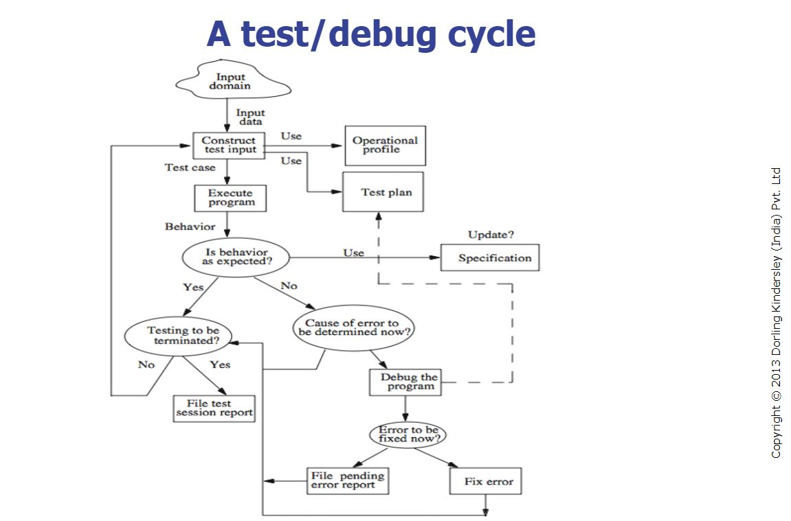

# Unit Testing

## Introduction to Unit Testing
Unit testing focuses on testing individual units or components of a software to ensure they function correctly. It can be done informally by the programmer or methodically by a Software Quality Assurance (SQA) team.

### Types of Methodical Unit Testing:
1. **Non-execution-based testing**: Inspects the code without running it, often using techniques such as reviews and static analysis.
2. **Execution-based testing**: Executes the code to verify behavior under specific conditions.

---

## Test Case Selection
Testing every possible case is impractical due to the sheer number of possible inputs (which can total up to **10^100** or more). A systematic approach to constructing test cases is needed. There are two main strategies:

- **Black-box testing** (specifications-based testing): 
  - Tests are based on the specifications, ignoring the internal code structure.
  
- **White-box testing** (code-based testing): 
  - Tests are based on the internal logic of the code, ignoring the external specifications.

---

## Error Detection and Removal
Errors are inevitable in software development due to human factors. Testing aims to find errors, while **correctness** ensures no errors exist. However, even after extensive testing, a program may still contain hidden bugs.

- **Software reliability** (ANSI/IEEE Std 729-1983):  
  The probability that software will function without failure over a specified period in a defined environment.

---

## Test Debug Cycle
Testing and debugging form an iterative cycle. Bugs found during testing are debugged, and the software is re-tested until the desired reliability is achieved.

---

## Test Plan Example
A test plan is a guide for executing the test cycle. For instance, when testing a **sorting program**:

- Execute the program with two different input sequences (e.g., ascending and descending).
- Test edge cases such as an empty input sequence.
- Ensure robustness by providing invalid inputs and recording any program failures in the **Failure Report Form**.

---

## Test Case and Test Set
- **Test Case**: A set of input values for the program and the expected output.
- **Test Set**: A collection of test cases.

---

## Testing vs. Verification
- **Verification**: Proves the correctness of a program by ensuring it contains no errors.
- **Testing**: Aims to uncover errors by running the program under various conditions.

Though both methods are complementary, testing is more commonly used in practice. Verification is not foolproof and may miss errors due to incorrect assumptions or incomplete verification.